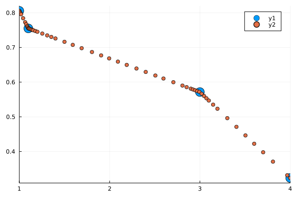
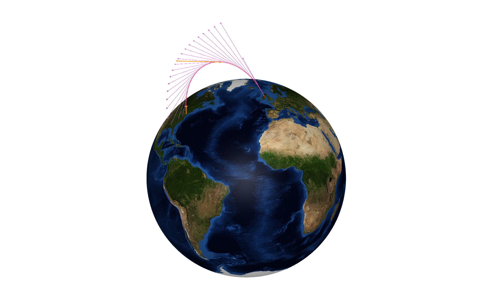

# GeoCoordinates

## Installation

* Install Julia v1.7.0 or greater from JuliaLang.org's [downloads page](https://julialang.org/downloads/). 

* Run Julia in terminal

  * The default Github API has changed to use Personal Access Tokens, so you will need to type ``` ENV["JULIA_PKG_USE_CLI_GIT"]=true ``` into the REPL to import from a private repository without generating a PAT first. 
  

  * The Julia package manager REPL can be accessed by typing ```]``` into the default REPL and then ```add https://github.com/kathesch/GeoCoordinates.jl``` 
  
  * Alternatively, you can use ```import Pkg; Pkg.add(url="https://github.com/kathesch/GeoCoordinates.jl")```

* API references can be accessed via the help REPL by typing ```?``` followed by the function you are interested in seeing the docstring for. 

```
~ % julia

   _       _ _(_)_     |  Documentation: https://docs.julialang.org
  (_)     | (_) (_)    |
   _ _   _| |_  __ _   |  Type "?" for help, "]?" for Pkg help.
  | | | | | | |/ _` |  |
  | | |_| | | | (_| |  |  Version 1.9.0-DEV.1074 (2022-08-02)
 _/ |\__'_|_|_|\__'_|  |  Commit eedf3f150c (2 days old master)
|__/                   |
```
```julia
julia> ENV["JULIA_PKG_USE_CLI_GIT"]=true
(@v1.9) pkg> add https://github.com/kathesch/GeoCoordinates.jl
julia> using GeoCoordinates
```

## API

Given coordinates in LLA, London for example, (51.5072°N, 0.12°W, 2m), we can obtain a vector of ECEF (X,Y,Z) coordinates using ```lla2xyz(lat, long, altitude)```.

Latitudes and longitudes are taken as positive degree values being North and East respectively.

```julia
julia> lla2xyz(51.5072, 0.12, 2)
3-element Vector{Float64}:
    3.9780141057281126e6
 8331.545442374172
    4.968862652915071e6
```

And we can then convert these back into LLA to obtain our previous input using ```xyz2lla(X,Y,Z)```.

```julia
julia> xyz2lla(ans)
3-element Vector{Float64}:
 51.5072
  0.12000000000000001
  2.0
```

Additionally, linear interpolation is possible with the ```lin_interp``` function. 

```julia
julia> xs = [1,1.1,3,4]
4-element Vector{Float64}:
 1.0
 1.1
 3.0
 4.0

julia> ys = rand(4)
4-element Vector{Float64}:
 0.8056397472418082
 0.7549247920881392
 0.5714319431723006
 0.3234866269090587

julia> scatter(xs,ys,markersize=10,xlims=(0,5))
julia> scatter!(x->lin_interp(x,xs,ys),xlims=(1,4))
```




## Example Plots


